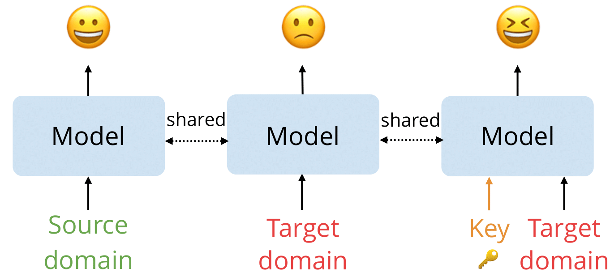

# Unsupervised-Non-transferable-Text-Classification

This repository is for our EMNLP' 22 paper:

> Unsupervised Non-transferable Text Classification [ArXiv](https://arxiv.org/abs/2210.12651)
>
> [Guangtao Zeng](github.com/ChaosCodes), [Wei Lu](istd.sutd.edu.sg/people/faculty/lu-wei)

## Overview

We propose a novel unsupervised non-transferable learning method for the text classification task that does not require annotated target domain data. We further introduce a secret key component in our approach for recovering the access to the target domain, where we design both an explicit (prompt secret key) and an implicit method (adapter secret key) for doing so. 



## Install dependencies

Run the following scripts to install the dependencies.

```shell
pip install -r requirements.txt
```


## Training

Create a directory `outputs` for storing the checkpoints by:

```shell
mkdir outputs
```

Run the scripts to train the UNTL model.

```shell
python UNTL.py
```

As for the secret key based methods, run the following scripts to train the models

* Train the prompt secret key based model

  ```sh
  python UNTL_with_prefix.py
  ```

* Train the adapter secret key based model

  ```sh
  python UNTL_with_adapter.py
  ```


## Evaluatoin

After finishing training, run the following scripts for evaluating the model.

1. Evaluate the UNTL model

   ```shell
   python predict.py
   ```

2. Evaluate the prompt secret key based model

   ```sh
   python predict_prefix.py
   ```

3. Evaluate the adapter secret key based model

   ```shell
   python predict_adapter.py
   ```


## Reference

```
@inproceedings{zeng2022unsupervised,
  author    = {Guangtao Zeng and Wei Lu},
  title     = {Unsupervised Non-transferable Text Classification},
  booktitle = {Proceedings of EMNLP},
  year      = {2022}
}
```

